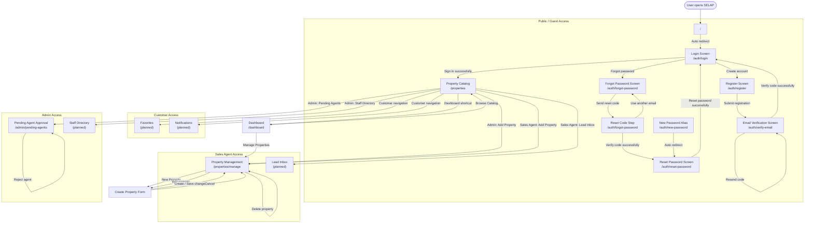

# SELAP Screen Transition Diagram

## Notes

- After a successful login, the current implementation redirects all roles to the Property Catalog screen.
- The navigation bar changes by role after reading the signed-in user's role from the access token and `/auth/me`.
- Favorites, Notifications, Lead Inbox, and Staff Directory are present as navigation targets but are not implemented as real routes yet.
- Property Management supports listing, searching, creating, editing, deleting, uploading images, and updating property status.
- Pending Agent Approval lets Admin users approve Sales Agent accounts after assigning an area, or reject pending accounts.
