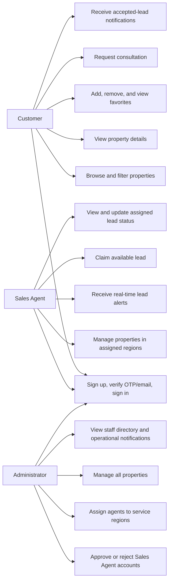
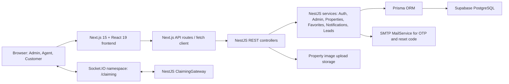
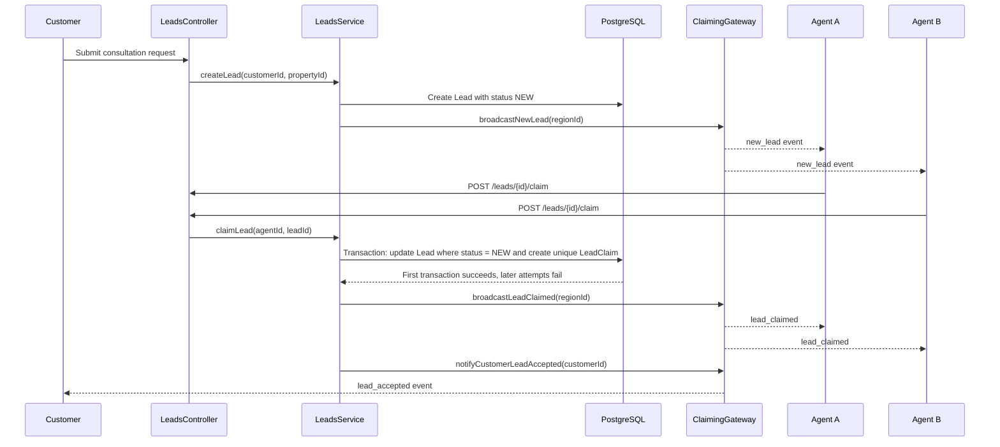
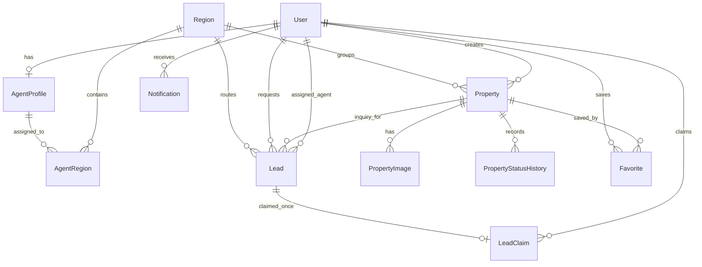

# SELAP Final Presentation Content

Source basis: PA0 to PA3 documents and the current source code under `src/backend` and `src/frontend`.

Important presenter note: `PA4` is not present in the workspace. PA3 contains the test plan and schedule, but not Katalon pass screenshots. The automation slide below includes clear placeholders for the pass images once PA4 or the screenshots are added.

## Slide 1. Problem Statement: Real Estate Operations Are Still Fragmented

- Small and medium real estate businesses often manage property inventory, customer data, and transaction updates through Excel files, Zalo, Telegram, or separate listing platforms.
- Property status is not synchronized in real time, so different agents may give customers outdated or conflicting information.
- Lead assignment is often manual and opaque, creating internal disputes when multiple agents want to handle the same customer.
- Managers lack a structured way to assign agents by area and evaluate performance by local market coverage.

Speaker note: Start with the market pain: the problem is not only listing properties online. The bigger issue is internal coordination, data trust, and lead ownership.

## Slide 2. Product Positioning: What SELAP Provides

- SELAP is a centralized real estate management web platform for property inventory, users, favorites, consultation requests, notifications, and lead claiming.
- The product focuses on three differentiators:
- Centralized repository: one source of truth for properties, users, regions, favorites, leads, and notifications.
- Real-time lead sharing: Socket.IO broadcasts new consultation requests to eligible agents immediately.
- Regional agent partitioning: Sales Agents only receive and manage leads/properties in their assigned regions.

Positioning statement: SELAP helps real estate teams reduce fragmented data, prevent lead disputes, and respond faster to customers through a centralized, role-based, real-time management system.

## Slide 3. Target Users And Value Proposition

| User | Main Goals | SELAP Value |
| --- | --- | --- |
| Administrator | Approve agents, assign regions, manage staff and properties | Better control over operations, user status, and regional assignments |
| Sales Agent | Manage listings, receive new leads, claim customers quickly | Fair access to relevant leads and protected customer contact data after claiming |
| Customer | Browse properties, save favorites, request consultation | Faster property discovery and direct connection to an available agent |

## Slide 4. Project Management And Team Structure

| Member | Primary Role | Key Responsibilities |
| --- | --- | --- |
| Cao Hai Vy | Project Lead / Business Analyst | Sprint planning, requirement analysis, project coordination, backend support |
| Nguyen Lam Thao Trang | Backend Developer / QA Tester | Backend APIs, test planning, functional and integration testing |
| Nguyen Thanh Nguyen | Frontend Developer / Database Designer | Next.js UI, database schema, data relationships, frontend integration |
| Huynh Mai Tram | Frontend Developer / UI/UX Support | UI screens, user flows, responsive layout, usability refinement |

Speaker note: Mention that roles are primary ownership areas. In practice, members also supported each other across analysis, design, implementation, and testing.

## Slide 5. Agile/Scrum Workflow

- Methodology: Agile/Scrum with sprint-based planning, review, and incremental delivery.
- Task management: Jira for backlog planning, sprint tracking, and issue assignment.
- Version control: GitHub for source code management and team collaboration.
- Sprint structure:
- Sprint 1, 22 Jun to 4 Jul 2026: Foundation, authentication, requirements, and initial design.
- Sprint 2, 6 Jul to 18 Jul 2026: Property catalog, property management, and admin approval workflow.
- Sprint 3, 20 Jul to 1 Aug 2026: Real-time lead claiming, notifications, favorites, and WebSocket gateway.
- Sprint 4, 3 Aug to 15 Aug 2026: Testing, automation, performance checks, deployment preparation, demo materials.

## Slide 6. Software Requirements: Use Case Model

Core PA1 use cases: UC001 Sign Up, UC002 Sign In, UC004 Password Recovery, UC005 Browse/Filter Properties, UC007 Favorites, UC010 Request Consultation, UC011 to UC013 Property CRUD, UC014 Real-time Lead Notifications, UC015 Claim Lead, UC017 Approve Agent Account, UC018 Receive Notifications.

## Slide 7. Core Functional Requirements

- Authentication: users register with unique email and phone, verify a 4-digit OTP by email, then log in using phone number, password, and selected role.
- RBAC and account status: JWT-based authentication protects APIs; Sales Agent accounts start as PENDING and require Admin approval before access.
- Property management: Admins manage all properties; Sales Agents manage properties only inside assigned regions.
- Public catalog: users can search and filter by keyword, location, property type, price, area, and status.
- Favorites and notifications: users save properties and receive notifications when relevant property or lead status changes.
- Real-time lead claiming: customers submit consultation requests; eligible Sales Agents receive the lead by region and compete fairly through the "Accept" action.

## Slide 8. Non-Functional Requirements

- Performance target: core API responses should stay below 500 ms under normal conditions.
- Real-time target: lead and notification delivery should complete within 1 second, including the 100 concurrent user test scenario.
- Security: JWT access tokens, role-based authorization, account status validation, email verification, and secure password hashing.
- Data consistency: one lead can only be claimed once, even if multiple Sales Agents click "Accept" nearly simultaneously.
- Maintainability: modular monolithic backend with separated NestJS modules for Auth, Admin, Properties, Favorites, Notifications, Leads, and Claiming.
- Portability: deployment-ready for common cloud platforms such as Vercel for frontend, Render/Railway for backend, and Supabase PostgreSQL for database.

Implementation note: the current backend uses Node.js `scrypt` password hashing, which is a secure password hashing function. If the slide rubric expects bcrypt, present this as "secure password hashing (scrypt in current implementation; bcrypt-compatible requirement class)."

## Slide 9. Architecture: Modular Monolithic System

- Frontend: Next.js pages for login, registration, property catalog, property detail, favorites, notifications, property management, pending agents, staff directory, and lead inbox.
- Backend: NestJS 11 modular monolith with REST endpoints and Socket.IO gateway.
- Persistence: Prisma ORM maps application models to PostgreSQL.
- Real-time layer: WebSocket rooms segment messages by user and region.

## Slide 10. Design Highlight: Real-Time Lead Claiming

- Room partitioning: Sales Agents join `region_{regionId}` rooms; customers join `user_{userId}` rooms.
- Conflict handling: the first successful claim changes the lead from NEW to CLAIMED and creates a unique `LeadClaim`.
- Privacy design: customer contact is hidden until an agent successfully claims the lead.

## Slide 11. Database Schema Overview

Main entities: User, AgentProfile, Region, AgentRegion, Property, PropertyImage, PropertyStatusHistory, Favorite, Lead, LeadClaim, Notification.

Terminology note: PA documents sometimes use Area and LeadRequest. The current implementation names them Region and Lead.

## Slide 12. Implementation Evidence From The Current System

- Authentication: registration, email verification, login, password recovery, reset token, and `/auth/me`.
- Admin module: pending Sales Agent approval, rejection, region assignment, staff directory.
- Property module: public listing, detail view, management view, image upload, filtering, status history, favorite-status notifications.
- Lead module: create consultation request, view available leads, claim lead, view assigned leads, update lead status.
- Realtime module: Socket.IO `/claiming` namespace, JWT-authenticated connections, region rooms, user rooms, `new_lead`, `lead_claimed`, and `lead_accepted` events.
- Frontend screens: Login, Register, Verify Email, Forgot Password, Reset Password, Catalog, Property Detail, Favorites, Notifications, Property Management, Pending Agents, Staff Directory, Lead Inbox.

## Slide 13. Testing Strategy And QA Pyramid

| Test Level | Allocation | Purpose | Tools |
| --- | ---: | --- | --- |
| Unit Testing | 60% | Validate services, guards, DTO validation, utilities, and business rules quickly | Jest |
| Integration/API Testing | 25% | Validate module interaction, Prisma database behavior, REST endpoints, and lead-claim consistency | Jest, Supertest, Prisma test DB, Postman/Bruno |
| E2E/UI Testing | 15% | Validate critical user journeys across browser, backend, and database | Katalon Studio, Playwright/Cypress |
| Performance Testing | Targeted | Validate API latency, WebSocket latency, and concurrent lead claiming | k6, Locust, scripted Socket.IO/API clients |

PA3 planned coverage: 130 test cases across Authentication, Admin and Region Assignment, Property Management, Favorites, and Lead Management.

## Slide 14. Automation Testing With Katalon Studio

Recommended four automation scenarios for the presentation:

| Scenario | Business Risk Covered | Expected Evidence |
| --- | --- | --- |
| Customer registration and OTP/email verification | New customer onboarding and identity verification | Insert Katalon PASS screenshot |
| Sales Agent registration and Admin approval with region assignment | Prevents unauthorized agent access and enables regional routing | Insert Katalon PASS screenshot |
| Property creation and catalog filtering | Ensures inventory can be published and discovered | Insert Katalon PASS screenshot |
| Consultation request and real-time lead claiming conflict | Validates the SELAP core USP: first successful agent claims the lead | Insert Katalon PASS screenshot |

Presenter note: If PA4 is added later, replace the placeholders with the actual Katalon pass images and update the exact pass count.

## Slide 15. Test Results And System Stability

- Requirement/test design completion: 130 planned test cases documented in PA3.
- Detailed scenario coverage: 12 high-risk test specifications documented, including registration, pending-agent login restriction, password recovery, agent approval, property creation, favorite notification, consultation request, claim success, claim conflict, and real-time lead notification.
- Current repository smoke test: backend Jest smoke test passed, 1 test suite and 1 test case.
- Release quality gates:
- No unresolved Critical or High severity defects.
- Core API response time below 500 ms under normal conditions.
- Lead claiming and WebSocket notification flow below 1 second under 100 concurrent users.
- Concurrent lead claiming preserves database consistency: only one successful `LeadClaim` per lead.

Suggested wording after real Katalon execution: "All four automated Katalon scenarios passed successfully, confirming that the most important onboarding, admin, property, and real-time lead workflows are stable for demonstration."

## Slide 16. Closing Message

- SELAP is not just a property listing website; it is an internal operating platform for real estate teams.
- The system connects property data, users, regional assignments, customer requests, and real-time lead ownership in one workflow.
- The strongest product value is transparent, low-latency lead claiming with database-level consistency.
- Future improvements can include richer analytics dashboards, commission calculation, production cloud storage for property images, and expanded automated regression coverage.

